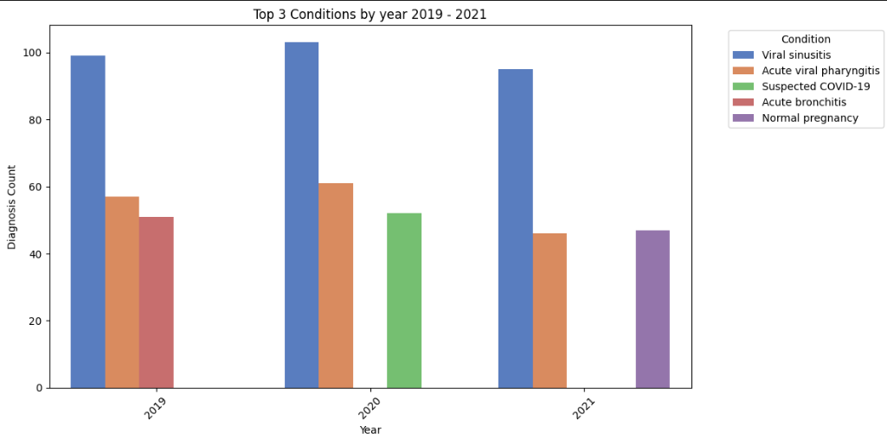

# Patients Condition / Weather 

## Problem Statement
Clinical diagnoses correlating to weather patterns.

## Methodology
Iteratively
* Data Wrangle
* Hypothesize
* Extract insights or correlation 

Given a dataset of clinical conditions found in a list of clinical encounters (inpatient and outpatient) 

## Steps
### Extract / Ingest EMR data
* This is ingested from synthetic realistic data from [Synthetic Mass | Synthea](https://synthea.mitre.org/) 
* Conditions are represented [SNOMED CT](https://www.snomed.org/what-is-snomed-ct) codes
### Extract weather data
* From Geo located patient encounters and diagnosis date extract weather data from [Open-Meteo](https://open-meteo.com/) historical APIs
* Cached weather data at Google Cloud Storage

## Data Pipeline 

### Exploratory Data Analysis (in RAW stage)
* [Data Summary](notebooks/eda_top_conditions.ipynb#DiagnosesDescription) 

* [Most Common Conditions](notebooks/eda_top_conditions.ipynb#Top10DiagnosesOverall)
    - 444814009	Viral sinusitis	
    - 195662009	Acute viral pharyngitis	
    - 10509002	Acute bronchitis
    

* [Most common Conditions 2019 - 2021](notebooks/eda_top_conditions.ipynb#Top3DiagnosesbyYearsince )

* [Most common conditions (%) by Daily Average Temperature Range (°C)](notebooks/eda_top_conditions.ipynb#Top3DiagnosesbyTemperatureRanges)

* [No correlation (linear) has been found yet between weather variables and diagnoses patterns](notebooks/eda_top_conditions.ipynb#Regression)

[Using Fake but Realistic Data from Synthea](https://synthea.mitre.org/downloads)
> Jason Walonoski, Mark Kramer, Joseph Nichols, Andre Quina, Chris Moesel, Dylan Hall, Carlton Duffett, Kudakwashe Dube, Thomas Gallagher, Scott McLachlan, Synthea: An approach, method, and software mechanism for generating synthetic patients and the synthetic electronic health care record, Journal of the American Medical Informatics Association, Volume 25, Issue 3, March 2018, Pages 230–238, https://doi.org/10.1093/jamia/ocx079

